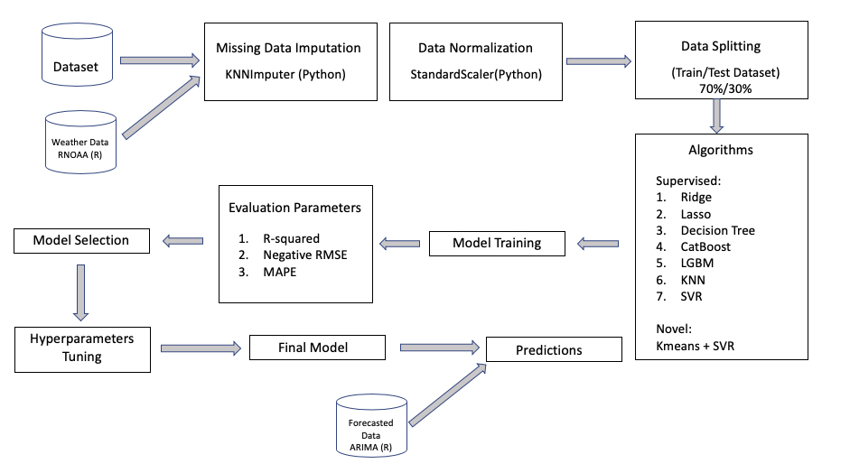

# Cherry Blossom Prediction :cherry_blossom:

#### Authors: Amelia Tang, Alex Yinan Guo, Nick Lisheng Mao
contact: amelia9@ubc.student.ca, alex.yinan.guo@gmail.com, nickmao1994@gmail.com
  University of British Columbia, Master's of Data Science (MDS)

## About

Originated in Japan, the tradition to celebrate cherry blossoms
have been embraced by different cultures for the recent decades. In
participation in the George Mason’s Department of Statistics [cherry
blossom peak bloom prediction competition](https://github.com/GMU-CherryBlossomCompetition/peak-bloom-prediction) and for our passion to study
this culturally and economically important event for many cities and
regions across the globe, we built multiple supervised machine learning
models and a novel model combining supervised and unsupervised learning
algorithms to predict the peak bloom dates of cherry trees in Kyoto,
Japan, Washington DC, USA, Vancouver, Canada and Liestal, Switzerland.
The below figure demonstrates the workflow of our project.

## Report

The final report can be found
[here](https://github.com/aimee0317/cherry-blossom-prediction/blob/main/doc/cherry_blossom_prediction_report.pdf).

Our codes associated with the final report can be found [here](https://github.com/aimee0317/cherry-blossom-prediction/tree/main/src). 

Our final predictions can be found [here](https://github.com/aimee0317/cherry-blossom-prediction/blob/main/cherry-predictions.csv).

## Dependencies

TBU A complete list of dependencies is available
[here](https://github.com/aimee0317/cherry-blossom-prediction/blob/main/blossom.yaml).
  - Python 3.9.10 and Python packages:   - pandas==1.4.0   -
numpy==1.21.5   - altair\_saver=0.5.0   - altair=4.1.0   -
scikit-learn=1.0.2   - catboost=1.0.4

## Usage

### Creating the environment

`conda env create --file blossom.yaml`

Run the following command from the environment where you installed
JupyterLab.

`conda install nb_conda_kernels`

If you are a windows user, run the following command inside the newly
created environment to install vega-lite.

`npm install -g vega vega-cli vega-lite canvas`

For M1 mac users, make sure you are using the `x86` version of conda and
not the `arm64` version. See
[here](https://github.com/conda-forge/miniforge#miniforge3) and
[here](https://github.com/mwidjaja1/DSOnMacARM/blob/main/README.md) for
more info.

## References
Amir, Amora, Marya Butt, and Olaf Van Kooten. 2021. “Using Machine Learning Algorithms to Forecast the Sap Flow of Cherry Tomatoes in a Greenhouse.” IEEE Access 9: 154183–93. https://doi.org/10.1109/ACCESS.2021.3127453.

 Anna Veronika Dorogush, Andrey Gulin, Vasily Ershov. 2018. “CatBoost: Gradient Boosting with Categorical Features Support.” "https://arxiv.org/abs/1810.11363".

 Chamberlain, Scott. 2021. Rnoaa: ’NOAA’ Weather Data from r. https://CRAN.R-project.org/package=rnoaa.
Graham, Karen. 2021. “Climate Change Likely Cause of Japan’s ‘Earliest Cherry Blossoms’.” Digital Journal, March. https://www.digitaljournal.com/world/climate-change-likely-cause-of-japan-s-earliest-cherry-blossoms/article/587700.

 Harris, Charles R., K. Jarrod Millman, Stéfan J van der Walt, Ralf Gommers, Pauli Virtanen, David Cournapeau, Eric Wieser, et al. 2020. “Array Programming with NumPy.” Nature 585: 357–62. https://doi.org/10.1038/s41586-020-2649-2.

 Jin, Xin, and Jiawei Han. 2010. “K-Means Clustering.” In Encyclopedia of Machine Learning, edited by Claude Sammut and Geoffrey I. Webb, 563–64. Boston, MA: 
Springer US. https://doi.org/10.1007/978-0-387-30164-8_425.

 Ke, Guolin, Qi Meng, Thomas Finley, Taifeng Wang, Wei Chen, Weidong Ma, Qiwei Ye, and Tie-Yan Liu. 2017. “Lightgbm: A Highly Efficient Gradient Boosting Decision Tree.” Advances in Neural Information Processing Systems 30: 3146–54.

 McKinney, Wes et al. 2010. “Data Structures for Statistical Computing in Python.” In Proceedings of the 9th Python in Science Conference, 445:51–56. Austin, TX.

 Nagai, Shin, Hiroshi Morimoto, and Taku M. Saitoh. 2020. “A Simpler Way to Predict Flowering and Full Bloom Dates of Cherry Blossoms by Self-Organizing Maps.” Ecological Informatics 56: 101040. https://doi.org/https://doi.org/10.1016/j.ecoinf.2019.101040.

 Pedregosa, Fabian, Gaël Varoquaux, Alexandre Gramfort, Vincent Michel, Bertrand Thirion, Olivier Grisel, Mathieu Blondel, et al. 2011. “Scikit-Learn: Machine Learning in Python.” Journal of Machine Learning Research 12 (Oct): 2825–30.

 Ritchie, Hannah, and Max Roser. 2020. “Co₂ and Greenhouse Gas Emissions.” Our World in Data.

 Sakurai, Ryo, Susan Jacobson, Hiromi Kobori, Richard Primack, Kohei Oka, Naoya Komatsu, and Ryo Machida. 2011. “Culture and Climate Change: Japanese Cherry Blossom Festivals and Stakeholders’ Knowledge and Attitudes about Global Climate Change.” Biological Conservation - BIOL CONSERV 144 (January): 654–58. https://doi.org/10.1016/j.biocon.2010.09.028.

 Tibshirani, Robert. 2011. “Regression Shrinkage and Selection via the Lasso: A Retrospective.” Journal of the Royal Statistical Society: Series B (Statistical Methodology) 73 (3): 273–82. https://doi.org/10.1111/j.1467-9868.2011.00771.x.

 Van Rossum, Guido, and Fred L. Drake. 2009. Python 3 Reference Manual. Scotts Valley, CA: CreateSpace.

 Yao, Zizhen, and Walter L Ruzzo. 2006. “A Regression-Based k Nearest Neighbor Algorithm for Gene Function Prediction from Heterogeneous Data.” BMC Bioinformatics 7 (S1). https://doi.org/10.1186/1471-2105-7-s1-s11. 
