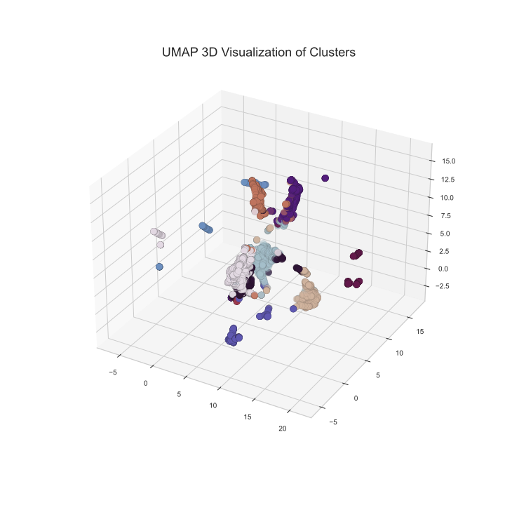
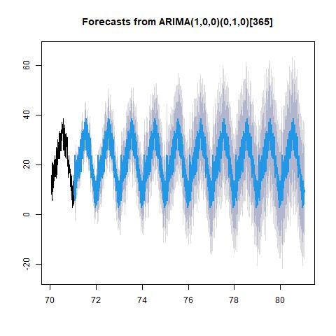

```{r setup, include=FALSE}
knitr::opts_chunk$set(echo = FALSE)
library(knitr)
library(kableExtra)
library(tidyverse)
library(scales)
```

```{r read_cv_score, include=FALSE}
cv_score <- read_csv("../results/model_selection.csv")
``` 

# Summary

Though originated in Japan, the tradition to celebrate cherry blossoms have been embraced by different cultures for the recent decades. In participation in the George Mason's Department of Statistics cherry blossom peak bloom prediction competition and for our passion to study this culturally and economically important event for many cities and regions across the globe, we built multiple supervised machine learning models and a novel model combining supervised and unsupervised learning algorithms to predict the peak bloom dates of cherry trees in Kyoto, Japan, Washington DC, USA, Vancouver, Canada and Liestal, Switzerland. Figure 1 demonstrates the workflow of our project.    

```{r workflow, warning=FALSE, fig.cap="Figure 1. Workflow of the Project", out.width="80%", fig.align = "center"}
knitr::include_graphics("../results/workflow.jpg")
```

Our best performing model Categorical Boosting (CatBoost) delivered a xxxxxxxxx. Although had disappointing performance, we expected our novel model would achieve better results if we could obtain a larger data set. We applied an ARIMA model to forecast important weather data used in the CatBoost model and performed predictions on the peak blossom dates.  

# Introduction

In recent years, many studies have implemented machine learning techniques to study topics in agronomy and forestry. In 2021, a study carried out by the Research and Innovation Centre Techniek in the Netherlands forecast the sap flow of cherry tomatoes in a greenhouse leveraging several supervised machine learning algorithms including linear models, such as linear regression (LR), least absolute shrinkage and selection operator (LASSO), elastic net regression (ENR), distance-based algorithms, such as support vector regression (SVR), and tree-based algorithms, such as random forest (RF), gradient boosting (GB) and decision tree (DT) [@9611229]. Among all the models, random forest performed the best, achieving an $R^2$ of $0.808$. Meanwhile, a 2020 study published in Ecological Informatics utilized an unsupervised machine learning technique, self-organizing maps (SOM), to predict peak bloom dates of Yashino cherry trees. However, the unsupervised machine learning models failed to deliver better results than a process-based phenology model did [@NAGAI2020101040]. 

In our project, we built multiple supervised learning models using popular algorithms for predictions, including linear least squares with L2 regularization (Ridge), least absolute shrinkage and selection operator (LASSO), support vector regression (SVR), k-nearest neighbors (KNN), decision tree (DT), categorical boosting (CatBoost), extreme gradient boosting (XGBoost) and Light Gradient Boosting Machine (LGBM). In addition, we implemented a novel strategy and proposed a model leveraging both supervised and unsupervised learning based on K-means clustering (Kmeans) and support vector regression (SVR). After comparing the performances, we constructed a final model using categorical boosting (CatBoost).        

# Methods
## Data Collection 

We collected the initial data sets from the George Mason's Department of Statistics cherry blossom peak bloom prediction competition's [Github repository](https://github.com/GMU-CherryBlossomCompetition/peak-bloom-prediction). The data sets contained peak cherry blossom dates in Kyoto, Liestal, Washington, DC, and other cities in Switzerland and South Korea. In addition, the Github repository provided data sets from USA National Phenology Network (USA-NPN) containing information on accumulated growing degree days (AGDD), average, maximum and minimum temperatures in winter and spring, accumulated precipitations in winter and spring for individual cherry trees located in different states in the United States. The development of cherry blossom depends highly on geographical locations and local climate [@climate]. Therefore, we extracted features from the USA-NPN data set and retrieved climate data from National Oceanic and Atmospheric Administration [@rnoaa]. 

To collect the weather data, we found a weather station close to each city by roughly matching latitude and longitude and utilized the `rnoaa` package in R [@rnoaa]. We retrieved the daily data including the maximum temperatures, minimum temperatures and precipitations and calculated their average values by year. As most cherry trees would blossom in spring, we believed the weather data in winter of the previous year would be a reasonable predictor for peak cherry blossom dates. Therefore, we also included the average maximum temperatures, minimum temperatures and precipitations in winter (December in the previous year and January and February of the current year). 

Accumulated Growing Degree Day (AGDD) was another feature we extracted from the USA-NPN data. We calculated AGDDs using this formula: $\sum(\frac{\text{T_max}+\text{T_min}}{2} - \text{T_base})$. We assumed $\text{T_base}=0$, which was a default value provied by USA-NPN data. We used the temperature data of December from the previous year and January and February in the current year to calculate AGDDs. 

In addition to the features extracted from the USA NPN data set, we included yearly Carbon Dioxide emission data for each country because the global warming had resulted in earlier cherry blossom dates in recent decades [@graham_2021]. We collected the Carbon Dioxide emission data from a research published on Our Word in Data [@owidco2andothergreenhousegasemissions]

### Processing 

We had 6182 lines of data after applying a filter to extract all the data after the year 1950 and 711 lines contained missing data. We decided to use data after 1950 because ancient climate and environment might not be reflective of these during the recent years. A simplistic imputing technique that would fill in the missing data using median, mean or the most frequent values would not provide an accurate picture in our case. Each feature in the data set reflected information for each city and we had imbalanced amounts of data for each city. For instance, we had 141 lines of data for Kyoto and only 72 lines of data for Liestal. Therefore, we used K-Nearest Neighbors (KNN) algorithm for missing data imputation. This imputation technique identified 10 rows in the data set that were similar for each missing data point and treated them as neighbors to impute missing values. We decided to weight each neighbor by the inverse of the distance so that the closest neighbors would have the greatest influence. We selected the following variables in our processed data set for the project: 
<br> - year 
<br> - latitude 
<br> - longitude
<br> - altitude 
<br> - maximum temperature 
<br> - minimum temperature 
<br> - precipitation 
<br> - winter AGDD 
<br> - maximum temperature in winter 
<br> - minimum temperature in winter
<br> - precipitation in winter 
<br> - CO2 emission per capita 

## Exploratory Data Analysis (EDA) 

We conducted preliminary data analysis on the initial data sets for exploration and feature extraction. A report can be accessed [here](https://github.com/aimee0317/cherry-blossom-prediction/blob/main/src/EDA/EDA_original_data.pdf).

We then conducted further analysis on the processed data set and a report can be accessed [here](https://github.com/aimee0317/cherry-blossom-prediction/blob/main/src/EDA/EDA_processed_data.pdf). From the correlation matrix (figure 1), we identified potential multicollinearity. 

```{r locations, warning=FALSE, fig.cap="Figure 2. Some features are highly correlated", out.width="70%", fig.align = "center"}
knitr::include_graphics("../results/corr.png")
```

To identify outliers in our processed data set, we plotted residuals v.s. leverage plot and did not identify any significant outliers by looking at the cook's distance.  

```{r outlier, warning=FALSE, fig.cap="Figure 3. No significant outliers identified", out.width="70%", fig.align = "center"}
knitr::include_graphics("../results/outlier.png")
```

## Models

We performed a standard 70/30 random split on our data.The Python programming languages [@Python] and the following Python packages were used to perform the analysis: numpy [@2020NumPy-Array], pandas [@mckinney2010data], scikitlearn [@pedregosa2011scikit] and Catboost [@Catboost], LightBGM [@ke2017lightgbm]. The coded used to build the models can be found [here](https://github.com/aimee0317/cherry-blossom-prediction/tree/main/src).  

### Supervised Machine Learning Models

#### Linear Regression Models

First, we chose to use LASSO and Ridge instead of a regular multiple linear regression model because these two algorithms would use L1 and L2 regularization respectively to handle multicollearity [@tibshirani_2011]. 


#### Tree-Based Models

In addition to linear models, we built three tree-based models utilizing decision tree (DT), Light Gradient Boosting Machine (LGBM), and Categorical Boosting (CatBoost). DT builds regression models by setting binary rules and using a tree structure. Both LGBM and CatBoost algorithms are tree-based models leveraging gradient boosting. LGBM was built upon gradient-boosted decision tree to incorporate exclusive feature bundling technique (EFB) [@ke2017lightgbm]. Catboost is a gradient-boosted decision tree model that orders boosting with ordered target statistics to solve the problem of prediction shift of gradient boosting [@Catboost].         

#### Distance-Based Models

Moreover, we implemented two distance-based algorithms in our models, Support Vector Regression (SVR) and k-nearest neighbors (KNN). SVR constructs a hyperplane to seperate the training data in N dimensions to perform regressions [@9611229]. The equation is:     
$\begin{equation*} f(x)=x'\beta +b\tag{5}\end{equation*}$ 

KNN measures euclidean distance to determine the similarity of data points based on all features and identifies k closest points to a target point in the training data. It takes an average to decide the target point's value [@yao_ruzzo_2006]. 

### Unsupervised Machine Learning Model
#### K-means + SVR 

We proposed a novel strategy to leverage an unsupervised machine learning algorithm for the regression problem. K-means Clustering (K-means) initializes non-optimal clusters, relocates each point to its nearest center and updates clustering centers through an iterative process [@Jin2010]. We implemented kmeans on the data set and partitioned our training data into 11 clusters. Figure 4 is the 3D visualization of the 11 clusters. We observed that the clusters had imbalanced amounts of data and some had only few observations.      

```{r kmeans, warning=FALSE, fig.cap="Figure 4. Some clusters have very few data points", out.width="60%", fig.align = "center"}

```
Then, we trained a SVR model on each cluster to perform regression. This novel model combining K-means and SVR delivered a negative RMSE of around -27. It performed worse than all the supervised algorithms we implemented. 

#### Model Selection
Based on the cross validation scores in Table 1, we chose the best performing model, CatBoost regression, for further hyperparameter tuning. 

```{r model_comparison, message=FALSE, warning=FALSE, echo=FALSE, out.width = '90%'}
names(cv_score)[1] <- ""
cv_score[1, 1] <- "cv_neg_RMSE"

cv_subset <- subset(cv_score, select = c(1,3,4,5,6,7,8, 9))
cv_subset |>
  kbl(caption = "Table 1. Tree-based models performed better than linear regressions.") |>
  kable_styling()
```

#### Hyperparameter Optimization

Based on the cross validation results of the models mentioned above, we chose the best performing model, CatBoost regression, to perform hyperparameter optimization. We used randomized search to tune the maximum depth of the tree, the maximum number of trees that can be built, and stength of the L2 regularizer. We then built a new CatBoost regression using the returned optimized hyperparameters and performed cross validations. The model, delivering a $R^2$ of 95.4%, a negative RMSE of $-4.629$ and MAPE of $-4.101$, did not outperform the model with default maximum depth of 6, 1000 trees and a value of 3 for the L2 regularizer. Therefore, we used the default hyperparameters to construct our final prediction model.    


## Forecasting 
To apply our final model to predict peak cherry blossom date for the future ten years, we forecast the weather data and CO2 emission till 2031. As we had obtained daily weather data from the `rnoaa` package, we fit an ARIMA model and an Exponential Smoothing model by daily granularity and aggregated them to obtain yearly forecast. To test our forecast model, we manually split the maximum temperature (Tmax) data before 2015 as a training set and 2015 and after as a testing set. We achieved a better result using the ARIMA model, so we decided to apply the ARIMA model to the rest of the weather data. We wrangled the predicted daily data in the way that was mentioned in previous data processing section. The figure below shows the predicted daily tmax of Kyoto compared with one year of historical data.

```{r arima, fig.cap="Figure 5. Forecasting Plot for Daily Temperature in Kyoto", message=FALSE, warning=FALSE, echo=FALSE, out.width = '50%'}

```

As for carbon dioxide emission data, we applied ARIMA on all yearly CO2 emission data and forecast till year 2031.

# Results & Discussion
Our best performing model Categorical Boosting (CatBoost) acheived a test ......We applied the predicted weather and CO2 emission data to the model and predicted the future peak cherry blossom dates as shown in Table 2. 

```{r results, message=FALSE, warning=FALSE, echo=FALSE, out.width = '90%'}
results <- read_csv("../cherry-predictions.csv")
results |>
  kbl(caption = "Table 2. Peak Cherry Blossom Forecast 2022-2031") |>
  kable_styling()
```


However, our forecast was not without limitations. Our novel strategy performed poorly mainly because some clusters had rather few observations. If we could obtain a much larger data set then we might be able to improve its performance. We might also consider implementing other supervised machine learning algorithms, such as Ridge and CatBoost, on top of the K-mean algorithm to examined the performance of the novel model. Besides, a random grid search for hyperparameter tuning did not improve the performance of the default Categorical Boosting (CatBoost) model. If we had more computational power, we could have performed the grid search on larger ranges of values for the hyperparameters and expanded our search to more hyperparameters.  


# References
