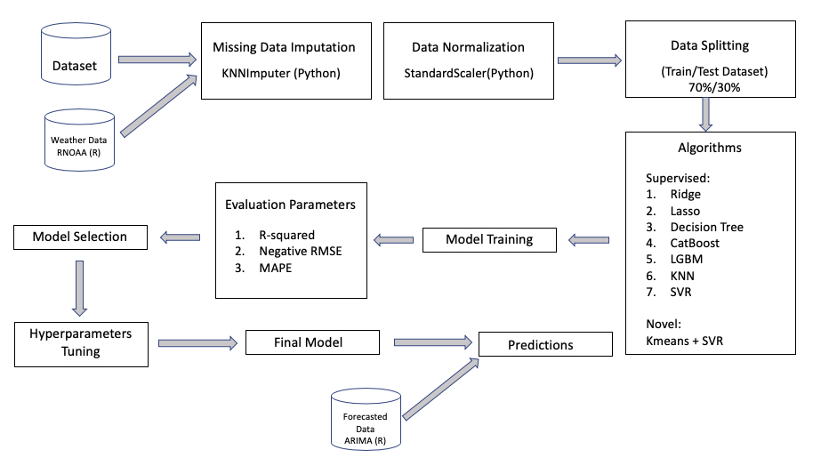

```{r setup, include=FALSE}
knitr::opts_chunk$set(echo = FALSE)
library(knitr)
library(kableExtra)
library(tidyverse)
library(scales)
```

```{r read_cv_score, include=FALSE}
cv_score <- read_csv("../results/model_selection.csv")
``` 

# Summary

```{r workflow, warning=FALSE, fig.cap="Figure 1. Workflow of the Project", out.width="80%", fig.align = "center"}

```

TBU (Amelia)

# Introduction

In recent years, many studies have implemented machine learning techniques to study topics in agronomy and forestry. In 2021, a study carried out by the Research and Innovation Centre Techniek in the Netherlands forecast the sap flow of cherry tomatoes in a greenhouse leveraging several supervised machine learning algorithms including linear models, such as linear regression (LR), least absolute shrinkage and selection operator (LASSO), elastic net regression (ENR), distance-based algorithms, such as support vector regression (SVR), and tree-based algorithms, such as random forest (RF), gradient boosting (GB) and decision tree (DT) [@9611229]. Among all the models, random forest performed the best, achieving an $R^2$ of $0.808$. Meanwhile, a 2020 study published in Ecological Informatics utilized an unsupervised machine learning technique, self-organizing maps (SOM), to predict peak bloom dates of Yashino cherry trees. However, the unsupervised machine learning models failed to deliver better results than a process-based phenology model did [@NAGAI2020101040]. 

In our project, we built multiple supervised learning models using popular algorithms for predictions, including linear least squares with L2 regularization (Ridge), least absolute shrinkage and selection operator (LASSO), support vector regression (SVR), k-nearest neighbors (KNN), decision tree (DT), categorical boosting (CatBoost), extreme gradient boosting (XGBoost) and Light Gradient Boosting Machine (LGBM). In addition, we implemented a novel strategy and proposed a model leveraging both supervised and unsupervised learning based on K-means clustering (Kmeans) and support vector regression (SVR). After comparing the performances, we constructed a final model using categorical boosting (CatBoost).        

# Methods
## Data Collection 

We collected the initial data sets from the George Mason's Department of Statistics cherry blossom peak bloom prediction competition's [Github repository](https://github.com/GMU-CherryBlossomCompetition/peak-bloom-prediction). The data sets contained peak cherry blossom dates in Kyoto, Liestal, Washington, DC, and other cities in Switzerland and South Korea. In addition, the Github repository provided data sets from USA National Phenology Network (USA-NPN) containing information on accumulated growing degree days (AGDD), average, maximum and minimum temperatures in winter and spring, accumulated precipitations in winter and spring for individual cherry trees located in different states in the United States. The development of cherry blossom depends highly on geographical locations and local climate [@climate]. Therefore, we extracted features from the USA-NPN data set and retrieved climate data from National Oceanic and Atmospheric Administration [@rnoaa]. 

To collect the weather data, we found a weather station close to each city by roughly matching latitude and longitude and utilized the `rnoaa` package in R [@rnoaa]. We retrieved the daily data including the maximum temperatures, minimum temperatures and precipitations and calculated their average values by year. As most cherry trees would blossom in spring, we believed the weather data in winter of the previous year would be a reasonable predictor for peak cherry blossom dates. Therefore, we also included the average maximum temperatures, minimum temperatures and precipitations in winter (December in the previous year and January and February of the current year). 

Accumulated Growing Degree Day (AGDD) was another feature we extracted from the USA-NPN data. We calculated AGDDs using this formula: $\sum(\frac{\text{T_max}+\text{T_min}}{2} - \text{T_base})$. We assumed $\text{T_base}=0$, which was a default value provied by USA-NPN data. We used the temperature data of December from the previous year and January and February in the current year to calculate AGDDs. 

In addition to the features extracted from the USA NPN data set, we included yearly Carbon Dioxide emission data for each country because the global warming had resulted in earlier cherry blossom dates in recent decades [@graham_2021]. We collected the Carbon Dioxide emission data from a research published on Our Word in Data [@owidco2andothergreenhousegasemissions]

### Processing 

We had 6182 lines of data after applying a filter to extract all the data after the year 1950 and 711 lines contained missing data. A simplistic imputing technique that would fill in the missing data using median, mean or the most frequent values would not provide an accurate picture in our case. Each feature in the data set reflected information for each city and we had imbalanced amounts of data for each city. For instance, we had 141 lines of data for Kyoto and only 72 lines of data for Liestal. Therefore, we used K-Nearest Neighbors (KNN) algorithm for missing data imputation. This imputation technique identified 10 rows in the data set that were similar for each missing data point and treated them as neighbors to impute missing values. We decided to weight each neighbor by the inverse of the distance so that the closest neighbors would have the greatest influence.         

## Exploratory Data Analysis (EDA) 

We conducted preliminary data analysis on the initial data sets for exploration and feature extraction. A report can be accessed [here](https://github.com/aimee0317/cherry-blossom-prediction/blob/main/src/EDA/EDA_original_data.pdf).

We then conducted further analysis on the processed data set and a report can be accessed [here](https://github.com/aimee0317/cherry-blossom-prediction/blob/main/src/EDA/EDA_processed_data.pdf). From the correlation matrix (figure 1), we identified potential multicollinearity. 

```{r locations, warning=FALSE, fig.cap="Figure 2. Some features are highly correlated", out.width="70%", fig.align = "center"}
knitr::include_graphics("../results/corr.png")
```

To identify outliers in our processed data set, we plotted residuals v.s. leverage plot and did not identify any significant outliers by looking at the cook's distance.  

```{r outlier, warning=FALSE, fig.cap="Figure 3. No significant outliers identified", out.width="70%", fig.align = "center"}
knitr::include_graphics("../results/outlier.png")
```

## Models

We performed a standard 70/30 random split on our data.The Python programming languages [@Python] and the following Python packages were used to perform the analysis: numpy [@2020NumPy-Array], pandas [@mckinney2010data], scikitlearn [@pedregosa2011scikit] and Catboost [@Catboost], LightBGM [@ke2017lightgbm]. The coded used to build the models can be found [here](scr/ml_models.ipynb) and here. 

### Supervised Machine Learning Models

#### Linear Regression Models

First, we chose to use LASSO and Ridge instead of a regular linear regression model because these two algorithms would use L1 and L2 regularization respectively to handle multicollearity. 


#### Tree-Based Models

In addition to linear models, we built three tree-based models utilizing decision tree (DT), Light Gradient Boosting Machine (LGBM), and Categorical Boosting (CatBoost). 
Decision tree regressions one of the predictive modelling approaches which develops decision trees incrementally by breaking down a data set into smaller and smaller subsets.
Both LGBM and Cat Boost algorithms are machine learning models based on gradient boosting [CITATION for gradient boosting]. Due to the sequentiality fitting of the gradient boosting, fitted trees are able to learn from mistakes made by previous trees to enhance performance. New trees are added to existing ones until the selected loss function stops to minimize.
LGBM incorporates two techniques, gradient based on side sampling (GOSS) and exclusive feature bundling (EFB) to achieve accurate results even with a smaller data set. This algorithm excludes data with small gradients and weights more for observations with large gradients for computation on information gain [CITATION FOR LGBM https://lightgbm.readthedocs.io/en/latest/pythonapi/lightgbm.LGBMRegressor.html]. 
CatBoost is a relatively new open-source machine learning algorithm developed in 2017 [NEED CITATION for cat boost https://catboost.ai/en/docs/]. Cat Boost is built on decision trees and gradient boosting. In this algorithm, a large number of weak models are sequentially combined and then selected through greedy search to form a strong prediction model. Cat Boost utilizes oblivious tree growing procedure, which increases computational efficiency and enables regularization to prevent overfitting. 

#### Distance-Based Models

ssssss

### Unsupervised Machine Learning Model
#### Kmeans + SVR 

```{r kmeans, warning=FALSE, fig.cap="Figure 4. Some clusters have very few data points", out.width="60%", fig.align = "center"}
knitr::include_graphics("../results/cluster.svg")
```

sssss
#### Model Selection
Based on the cross validation scores in Table 1, we chose the best performing model, CatBoost regression, for further hyperparameter tuning. 

```{r model_comparison, message=FALSE, warning=FALSE, echo=FALSE, out.width = '90%'}
names(cv_score)[1] <- ""
cv_score[1, 1] <- "cv_neg_RMSE"

cv_subset <- subset(cv_score, select = c(1,3,4,5,6,7,8, 9))
cv_subset |>
  kbl(caption = "Table 1. Tree-based models performed better than linear regressions.") |>
  kable_styling()
```

#### Hyperparameter Optimization

Based on the cross validation results of the models mentioned above, we chose the best performing model, CatBoost regression, to perform hyperparameter optimization. We used randomized search to tune the maximum depth of the tree, the maximum number of trees that can be built, and coefficient at the L2 regularization term of the cost function. We then built a new CatBoost regression using the returned optimized hyperparameters and performed cross validations. The model, delivering xxxx, did not outperform the model with default maximum depth of xxx and the maximum number of trees of xxx. Therefore, we used the default hyperparameters to construct our final prediction model. 


## Forecasting 
To apply our model and make prediction for the coming ten years, we need to forecast the weather data and co2 emission till 2031. As we have daily weather data from noaa, we fit an ARIMA model and an Exponential Smoothing model by daily granularity and aggregate them to obtain yearly forecast. To test our forecast model, we manually split the Tmax data before 2015 as training set and 2015 and after as testing set. We achieved a better result on ARIMA model, so we applied ARIMA model to the other weather data. The daily data we have by model forecasting are wrangled in the way that was mentioned in previous data processing part. The figure below shows the forecasted tmax parameter of Kyoto city compared with one year of real data.

```{r arima, fig.cap="Figure 5. Sample Forecasting Plot for Daily Temperature in Kyoto", message=FALSE, warning=FALSE, echo=FALSE, out.width = '50%'}

```

As for carbon dioxide data, we have granularity by year so we directly apply ARIMA on all co2 data and cast forecast till year 2031.

# Results & Discussion
results (Amelia)
discussion (limitations - more data, try different algorithms etc.)

The missing data imputation method using KNN is susceptible to scaling. 
Try K-means + Gradient boosting? 

# References
