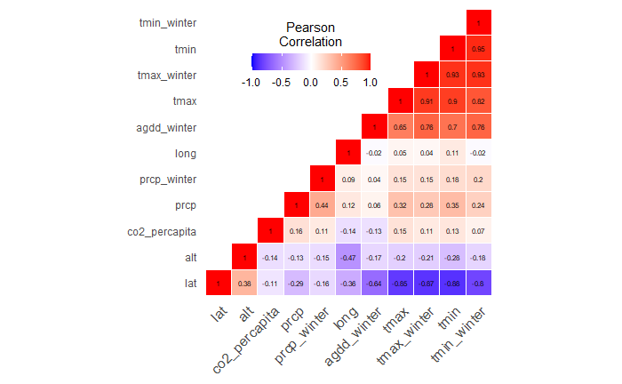
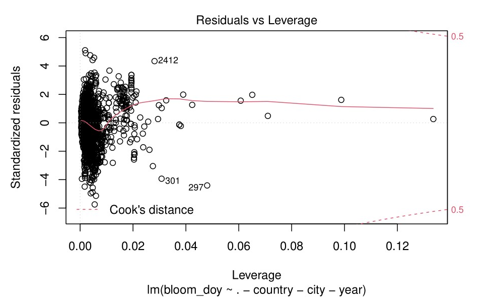
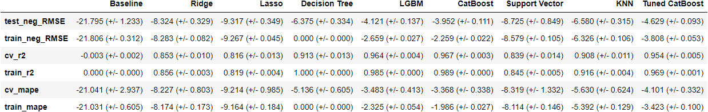

Cherry Blossom Prediction
================
Amelia Tang, Alex Yinan Guo, Nick Lisheng Mao
2022/02/23 (updated: 2022-02-27)

-   [Summary](#summary)
-   [Introduction](#introduction)
-   [Methods](#methods)
    -   [Data Collection and
        Processing](#data-collection-and-processing)
        -   [Data Collection (Nick)](#data-collection-nick)
        -   [Processing (Nick)](#processing-nick)
    -   [Exploratory Data Analysis (EDA) on Processed Data
        Sets](#exploratory-data-analysis-eda-on-processed-data-sets)
    -   [Models](#models)
        -   [Supervised Machine Learning
            Models](#supervised-machine-learning-models)
        -   [Unsupervised Models](#unsupervised-models)
    -   [Forecasting](#forecasting)
-   [Results & Discussion](#results--discussion)
-   [References](#references)

# Summary

TBU (Amelia)

# Introduction

In recent years, many studies have implemented machine learning
techniques to study topics, traditionally covered by phenology models,
in agronomy and forestry. In 2021, a study carried out by the Research
and Innovation Centre Techniek in the Netherlands forecast the sap flow
of cherry tomatoes in a greenhouse leveraging several supervised machine
learning algorithms including linear models, such as linear regression
(LR), least absolute shrinkage and selection operator (LASSO), elastic
net regression (ENR), distance-based algorithms, such as support vector
regression (SVR), and tree-based algorithms, such as random forest (RF),
gradient boosting (GB) and decision tree (DT). Among all the models,
Random forest performed the best, achieving an *R*2 of 0.808.
Meanwhile, a 2020 study published in Ecological Informatics utilized an
unsupervised machine learning technique, self-organizing maps (SOM), to
predict peak bloom dates of Yashino cherry trees. However, the
unsupervised machine learning models failed to deliver better results
than a process-based phenology model did.

In our project, we built multiple supervised learning models using
popular algorithms for predictions, including linear least squares with
L2 regularization (Ridge), least absolute shrinkage and selection
operator (LASSO), support vector regression (SVR), k-nearest neighbors
(KNN), decision tree (DT), categorical boosting (CatBoost), extreme
gradient boosting (XGBoost) and Light Gradient Boosting Machine (LGBM).
In addition, we implemented a novel strategy and proposed a model
leveraging both supervised and unsupervised learning based on K-means
clustering (Kmeans) and support vector regression (SVR). After comparing
the performances, we constructed a final model using xxx.

# Methods

## Data Collection and Processing

Before further data collection and process, we explored the original
eight data sets. Here is the [file](src/EDA/EDA_original_data.pdf) for
preliminary exploration, in which summary tables, density plots, time
series plots, and other visualizations are conducted. We were provided
with three city data sets regarding peak cherry blossom dates in Kyoto,
Japan, Liestal, Switzerland, and Washington DC, US. In addition, we have
three data sets containing peak cherry blossom dates in different cities
of Japan, South Korea, and Switzerland. We also have two data sets from
USA National Phenology Network (NPN) in terms of individual observations
on the cherry blossom, intensity of the bloom, and corresponding
phenometric features such as accumulated growing degree days (AGDD),
average maximum and minimum temperature in winter and spring,
accumulated precipitation in winter and spring, etc. Since we wanted to
predict the peak bloom, instead of the individual phenometrics data set,
we tried to process the status intensity data set for potential usage.
We first filtered the observations by intensity value over 75%, and then
selected the minimum values for the same site and year to get the
earliest observation date for over 75% bloom intensity. However, we only
had about 80 observations left after the process. Moreover, since we
defined the peak bloom as 70% for Washington, D.C., we were unable to
know the first date for over 70% bloom observation. Therefore, we did
not use USA NPN data sets in our model building. However, inspired by
the phenometric features in these two data sets, we used R package
“rnoaa” to extract weather data for cities in other three country data
sets for further model establishment, training, and prediction.

### Data Collection (Nick)

The development of cherry blossom depends highly on geographical
locations and local climate. In this project, we retrieve climate data
from National Oceanic and Atmospheric Administration {rnoaa} and Carbon
Dioxide emission data {owidco2andothergreenhousegasemissions}. Based on
the bloom date provided by organizer, we decide to do following data
wrangling.

The first step of incorporating weather data to blossom data is to find
a weather station close to each city. We match them roughly by latitude
and longitude. We retrieve the daily data including the max temperature,
min temperature and precipitation of a day and aggregate the mean values
of those three parameters by year. As most cherry blossom happens in
spring time, we expecte that the weather data in winter also have high
correlation with the prediction of bloom date. We aggregate these three
parameters by winter. Winter is defined as December in the previous year
and January and February of current year.

Inspired by USA-NPN data, we also create Accumulated Growing Degree Day
(agdd) as a variable to predict bloom date. Our agdd data is calculated
by using the formula:
$\\sum(\\frac{\\text{T_max}+\\text{T_min}}{2} - \\text{T_base})$. We
choose our T_base = 0, which is the parameter chosen by USA-NPN data. We
also use the temperature data of December from the previous year and
January and February in this year to calculate the agdd.

We want to include global warming variables into our prediction model as
a warmer weather will cause the cherry to bloom earlier. We use the
yearly Carbon Dioxide emission data from countries and matched them to
each blossom date from cities by year.

### Processing (Nick)

Imputation (Amelia)

We have xxx lines of missing data after applying a filter to extract all
the data after the year 1950. A simplistic imputing technique that would
fill in the missing data using median, mean or the most frequent values
would not provide an accurate picture in our case. Each feature in the
data set reflected information for each city and we had imbalanced
amounts of data for each city. For instance, we had xxx lines of data
for city xxx and only xxx lines of data for city xxx. Therefore, we used
K-Nearest Neighbors (KNN) algorithm for missing data imputation. This
imputation technique identified x rows in the data set that were similar
and treated them as neighbors to impute missing values. We decided to
weight each neighbor by the inverse of the distance so that the closest
neighbors would have the greatest influence.

## Exploratory Data Analysis (EDA) on Processed Data Sets

Exploratory Data Analysis (EDA) was carried out to determine the
distributions of data, as well as to get hints into how features could
be associated with bloom dates. In the [EDA
file](src/EDA/EDA_processed_data.pdf), we created summary tables,
density plots, plots of year v.s. numeric variables by countries,
correlation matrix of potential independent variables, and basic linear
regression models as reference. From the correlation matrix (figure 1),
we can see that certain features have strong correlation with others,
indicating multicollinearity. Therefore, we chose to use Lasso
regression and Ridge regression in the later model establishment because
these two methods can handle data with multicollinearity better. Figure
2 is the residuals v.s. leverage plot for detecting outliers. Based on
the Cook’s distance, we did not identify any potential outliers in our
data set.

## Models

We have decided to adopt regression models to predict the peak bloom
date. The dependent variable would be the peak bloom day of year, and
the independent variables would be latitude, longitude, annual maximum
and minimum temperature, annual accumulated precipitation, annual
maximum temperature in winter, annual accumulated precipitation in
winter, AGDD, CO2 emission per capital, and year. The processed data was
split into 70% train and 30% test data randomly. We used feature
transformers and models from Python scikit-learn \[NEED CITATION for
sklearn\] to create prediction models, train the models, conduct cross
validation, and select the best performed model as the final predictive
model for the peak bloom date. Codes used for model building and
selection can be found [here](scr/ml_models.ipynb).

### Supervised Machine Learning Models

#### Linear Regressions

First, we fitted the train data to Ridge regression and Lasso
regression. As mentioned in the EDA part, since there is
multicollinearity in the data set, we wanted regression methods that are
less vulnerable towards multicollinearity. Lasso and Ridge are linear
regression models with L1 and L2 regularization respectively.

#### Tree Based Machine Learning Models

In addition to linear regression methods, we adopted three tree-based
regressions into our model selection: decision tree, Light Gradient
Boosting Machine (LGBM), and Cat Boost. Decision tree regressions one of
the predictive modelling approaches which develops decision trees
incrementally by breaking down a data set into smaller and smaller
subsets. Both LGBM and Cat Boost algorithms are machine learning models
based on gradient boosting \[CITATION for gradient boosting\]. Due to
the sequentiality fitting of the gradient boosting, fitted trees are
able to learn from mistakes made by previous trees to enhance
performance. New trees are added to existing ones until the selected
loss function stops to minimize. LGBM incorporates two techniques,
gradient based on side sampling (GOSS) and exclusive feature bundling
(EFB) to achieve accurate results even with a smaller data set. This
algorithm excludes data with small gradients and weights more for
observations with large gradients for computation on information gain
\[CITATION FOR LGBM
<https://lightgbm.readthedocs.io/en/latest/pythonapi/lightgbm.LGBMRegressor.html>\].
CatBoost is a relatively new open-source machine learning algorithm
developed in 2017 \[NEED CITATION for cat boost
<https://catboost.ai/en/docs/>\]. Cat Boost is built on decision trees
and gradient boosting. In this algorithm, a large number of weak models
are sequentially combined and then selected through greedy search to
form a strong prediction model. Cat Boost utilizes oblivious tree
growing procedure, which increases computational efficiency and enables
regularization to prevent overfitting.

#### Distance Based Machine Learning Models

(Amelia)

#### Hyper parameter Optimization

Based on the cross validation results of the models mentioned above, we
chose the best performed model, Cat Boost regression, to perform hyper
parameter optimization. We used randomized search to tune the maximum
depth of the tree, the maximum number of trees that can be built, and
coefficient at the L2 regularization term of the cost function. We then
built a new Cat Boost regression using the returned optimized hyper
parameters and performed cross validation.

#### Cross Validation for Supervised Machine Learning Models

Table 1 is the cross validation results for the supervised machine
learning models. Based on criteria of cross validation, we chose the
best performed model, Cat Boost regression with default hyper
parameters, as the prediction model.

### Unsupervised Models

#### Kmeans + SVR

(Amelia)

## Forecasting

To apply our model and make prediction for the coming ten years, we need
to forecast the weather data and co2 emission till 2031. As we have
daily weather data from noaa, we fit an ARIMA model and an Exponential
Smoothing model by daily granularity and aggregate them to obtain yearly
forecast. To test our forecast model, we manually split the Tmax data
before 2015 as training set and 2015 and after as testing set. We
achieved a better result on ARIMA model, so we applied ARIMA model to
the other weather data. The daily data we have by model forecasting are
wrangled in the way that was mentioned in previous data processing part.
The figure below shows the forecasted tmax parameter of Kyoto city
compared with one year of real data.

#knitr::include_graphics(“../figure/tmax_extra.jpg”)

As for co2 data, we have granularity by year so we directly apply ARIMA
on all co2 data and cast forecast till year 2031.

# Results & Discussion

results (Amelia) discussion (limitations - more data, try different
algorithms etc.)

The missing data imputation method using KNN is susceptible to scaling.
Try K-means + Gradient boosting?

# References

TBU
