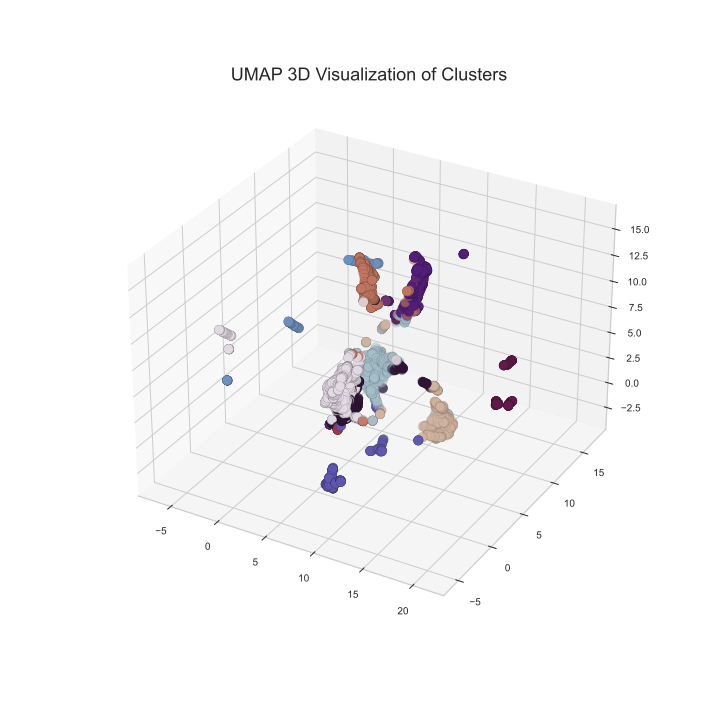

Cherry Blossom Prediction
================
Amelia Tang, Alex Yinan Guo, Nick Lisheng Mao
2022/02/23 (updated: 2022-02-28)

-   [Summary](#summary)
-   [Introduction](#introduction)
-   [Methods](#methods)
    -   [Data Collection](#data-collection)
        -   [Processing](#processing)
    -   [Exploratory Data Analysis
        (EDA)](#exploratory-data-analysis-eda)
    -   [Models](#models)
        -   [Supervised Machine Learning
            Models](#supervised-machine-learning-models)
        -   [Unsupervised Machine Learning
            Model](#unsupervised-machine-learning-model)
    -   [Forecasting](#forecasting)
-   [Results & Discussion](#results--discussion)
-   [References](#references)

# Summary

Originated in Japan, the tradition to celebrate cherry blossoms have
been embraced by different cultures for the recent decades. In
participation in the George Mason’s Department of Statistics cherry
blossom peak bloom prediction competition and for our passion to study
this culturally and economically important event for many cities and
regions across the globe, we built multiple supervised machine learning
models and a novel model combining supervised and unsupervised learning
algorithms to predict the peak bloom dates of cherry trees in Kyoto,
Japan, Washington DC, USA, Vancouver, Canada and Liestal, Switzerland.
Figure 1 demonstrates the workflow of our project.

Our best performing model Categorical Boosting (CatBoost) delivered a
*R*2 of 0.974, a negative RMSE of  − 3.75 and a MAPE of 3.135
on the test data. Although had disappointing performance, our novel
model might achieve better results if we could obtain a larger data set.
We applied an ARIMA model to forecast important weather data used in the
CatBoost model and performed predictions on the peak blossom dates.

# Introduction

In recent years, many studies have implemented machine learning
techniques to study topics in agronomy and forestry. In 2021, a study
carried out by the Research and Innovation Centre Techniek in the
Netherlands forecast the sap flow of cherry tomatoes in a greenhouse
leveraging several supervised machine learning algorithms including
linear models, such as linear regression (LR), least absolute shrinkage
and selection operator (LASSO), elastic net regression (ENR),
distance-based algorithms, such as support vector regression (SVR), and
tree-based algorithms, such as random forest (RF), gradient boosting
(GB) and decision tree (DT) (Amir, Butt, and Van Kooten 2021). Among all
the models, random forest performed the best, achieving an
*R*2 of 0.808. Meanwhile, a 2020 study published in
Ecological Informatics utilized an unsupervised machine learning
technique, self-organizing maps (SOM), to predict peak bloom dates of
Yashino cherry trees. However, the unsupervised machine learning models
failed to deliver better results than a process-based phenology model
did (Nagai, Morimoto, and Saitoh 2020).

In our project, we built multiple supervised learning models using
popular algorithms for predictions, including linear least squares with
L2 regularization (Ridge), least absolute shrinkage and selection
operator (LASSO), support vector regression (SVR), k-nearest neighbors
(KNN), decision tree (DT), categorical boosting (CatBoost), extreme
gradient boosting (XGBoost) and Light Gradient Boosting Machine (LGBM).
In addition, we implemented a novel strategy and proposed a model
leveraging both supervised and unsupervised learning based on K-means
clustering (Kmeans) and support vector regression (SVR). After comparing
the performances, we constructed a final model using categorical
boosting (CatBoost).

# Methods

## Data Collection

We collected the initial data sets from the George Mason’s Department of
Statistics cherry blossom peak bloom prediction competition’s [Github
repository](https://github.com/GMU-CherryBlossomCompetition/peak-bloom-prediction).
The data sets contained peak cherry blossom dates in Kyoto, Liestal,
Washington, DC, and other cities in Switzerland and South Korea. In
addition, the Github repository provided data sets from USA National
Phenology Network (USA-NPN) containing information on accumulated
growing degree days (AGDD), average, maximum and minimum temperatures in
winter and spring, accumulated precipitations in winter and spring for
individual cherry trees located in different states in the United
States. The development of cherry blossom depends highly on geographical
locations and local climate (Sakurai et al. 2011). Therefore, we
extracted features from the USA-NPN data set and retrieved climate data
from National Oceanic and Atmospheric Administration (Chamberlain 2021).

To collect the weather data, we found a weather station close to each
city by roughly matching latitude and longitude and utilized the `rnoaa`
package in R (Chamberlain 2021). We retrieved the daily data including
the maximum temperatures, minimum temperatures and precipitations and
calculated their average values by year. As most cherry trees would
blossom in spring, we believed the weather data in winter of the
previous year would be a reasonable predictor for cherry blossom peak
bloom dates. Therefore, we also included the average maximum
temperatures, minimum temperatures and precipitations in winter
(December in the previous year and January and February of the current
year).

Accumulated Growing Degree Day (AGDD) was another feature we extracted
from the USA-NPN data. We calculated AGDDs using this formula:
$\\sum (\\frac {T\_{max} + T\_{min}} {2} - T\_{base})$. We assumed
*T**b**a**s**e* = 0, which was a default value provided by
USA-NPN data. We used the temperature data of December from the previous
year and January and February in the current year to calculate AGDDs.

In addition to the features extracted from the USA NPN data set, we
included yearly carbon dioxide emission data for each country because
the global warming has resulted in earlier cherry blossom dates in
recent decades (Graham 2021). We collected the carbon dioxide emission
data from a research published on Our Word in Data (Ritchie and Roser
2020).

### Processing

We had 6182 lines of data after applying a filter to extract all the
data after the year 1950 and 711 lines contained missing data. We
decided to use data after 1950 because ancient climate and environment
might not be reflective of these during the recent years. A simplistic
imputing technique that would fill in the missing data using median,
mean or the most frequent values would not provide an accurate picture
in our case. Each feature in the data set reflected information for each
city and we had imbalanced amounts of data for each city. For instance,
we had 141 lines of data for Kyoto and only 72 lines of data for
Liestal. Therefore, we used K-Nearest Neighbors (KNN) algorithm for
missing data imputation. This imputation technique identified 10 rows in
the data set that were similar for each missing data point and treated
them as neighbors to impute missing values. We decided to weight each
neighbor by the inverse of the distance so that the closest neighbors
would have the greatest influence. We selected the following variables
in our processed data set for the project:   - year   - latitude
  - longitude   - altitude   - maximum temperature   -
minimum temperature   - precipitation   - winter AGDD   -
maximum temperature in winter   - minimum temperature in winter  
- precipitation in winter   - CO2 emission per capita

## Exploratory Data Analysis (EDA)

We conducted preliminary data analysis on the initial data sets for
exploration and feature extraction. A report can be accessed
[here](https://github.com/aimee0317/cherry-blossom-prediction/blob/main/src/EDA/EDA_original_data.pdf).

We then conducted further analysis on the processed data set and a
report can be accessed
[here](https://github.com/aimee0317/cherry-blossom-prediction/blob/main/src/EDA/EDA_processed_data.pdf).
From the correlation matrix (figure 1), we identified potential
multicollinearity.

To identify outliers in our processed data set, we plotted residuals
v.s. leverage plot and did not identify any significant outliers by
looking at the cook’s distance.

## Models

We performed a standard 70/30 random split on our data.The Python
programming languages (Van Rossum and Drake 2009) and the following
Python packages were used to perform the analysis: numpy (Harris et al.
2020), pandas (McKinney et al. 2010), scikitlearn (Pedregosa et al.
2011) and Catboost (Anna Veronika Dorogush 2018), LightBGM (Ke et al.
2017). The codes used to build the models can be found
[here](https://github.com/aimee0317/cherry-blossom-prediction/tree/main/src).

### Supervised Machine Learning Models

#### Linear Regression Models

First, we chose to use LASSO and Ridge instead of a regular multiple
linear regression model because these two algorithms would use L1 and L2
regularization respectively to handle multicollearity (Tibshirani 2011).

#### Tree-Based Models

In addition to linear models, we built three tree-based models utilizing
decision tree (DT), Light Gradient Boosting Machine (LGBM), and
Categorical Boosting (CatBoost). DT builds regression models by setting
binary rules and using a tree structure. Both LGBM and CatBoost
algorithms are tree-based models leveraging gradient boosting. LGBM was
built upon gradient-boosted decision tree to incorporate exclusive
feature bundling technique (EFB) (Ke et al. 2017). Catboost is a
gradient-boosted decision tree model that orders boosting with ordered
target statistics to solve the problem of prediction shift of gradient
boosting (Anna Veronika Dorogush 2018).

#### Distance-Based Models

Moreover, we implemented two distance-based algorithms in our models,
Support Vector Regression (SVR) and k-nearest neighbors (KNN). SVR
constructs a hyperplane to seperate the training data in N dimensions to
perform regressions (Amir, Butt, and Van Kooten 2021). The equation is:

*f*(*x*) = *x*′*β* + *b*

KNN measures euclidean distance to determine the similarity of data
points based on all features and identifies k closest points to a target
point in the training data. It takes an average to decide the target
point’s value (Yao and Ruzzo 2006).

### Unsupervised Machine Learning Model

#### K-means + SVR

We proposed a novel strategy to leverage an unsupervised machine
learning algorithm for the regression problem. K-means Clustering
(K-means) initializes non-optimal clusters, relocates each point to its
nearest center and updates clustering centers through an iterative
process (Jin and Han 2010). We implemented kmeans on the data set and
partitioned our training data into 11 clusters. Figure 4 is the 3D
visualization of the 11 clusters. We observed that the clusters had
imbalanced amounts of data and some had only few observations.

Then, we trained an SVR model on each cluster to perform regression.
This novel model combining K-means and SVR delivered a negative RMSE of
around -27. It performed worse than all the supervised algorithms we
implemented.

#### Model Selection

Based on the cross validation scores in Table 1, we chose the best
performing model, CatBoost regression, for further hyperparameter
tuning.

#### Hyperparameter Optimization

Based on the cross validation results of the models mentioned above, we
chose the best performing model, CatBoost regression, to perform
hyperparameter optimization. We used randomized search to tune the
maximum depth of the tree, the maximum number of trees that can be
built, and stength of the L2 regularizer. We then built a new CatBoost
regression using the returned optimized hyperparameters and performed
cross validations. The model, delivering a *R*2 of 0.954, a
negative RMSE of  − 4.629 and MAPE of  − 4.101, did not outperform the
model with default maximum depth of 6, 1000 trees and a value of 3 for
the L2 regularizer. Therefore, we used the default hyperparameters to
construct our final prediction model.

## Forecasting

To apply our final model to predict peak cherry blossom date for the
future ten years, we forecast the weather data and CO2 emission till
2031. As we had obtained daily weather data from the `rnoaa` package, we
fit an ARIMA model and an Exponential Smoothing model by daily
granularity and aggregated them to obtain yearly forecast. To test our
forecast model, we manually split the maximum temperature (Tmax) data
before 2015 as a training set and 2015 and after as a testing set. We
achieved a better result using the ARIMA model, so we decided to apply
the ARIMA model to the rest of the weather data. We wrangled the
predicted daily data in the way that was mentioned in previous data
processing section. The figure below shows the predicted daily tmax of
Kyoto compared with one year of historical data.

As for carbon dioxide emission data, we applied ARIMA on all yearly CO2
emission data and forecast till year 2031.

# Results & Discussion

Our best performing model Categorical Boosting (CatBoost) achieved a
*R*2 of 0.974, a negative RMSE of  − 3.75 and a MAPE of 3.135
on the test data. We applied the predicted weather and CO2 emission data
to the model and predicted the future peak cherry blossom dates as shown
in Table 2.

<table class="table" style="margin-left: auto; margin-right: auto;">
<caption>
Peak Cherry Blossom Forecast 2022-2031
</caption>
<thead>
<tr>
<th style="text-align:right;">
year
</th>
<th style="text-align:right;">
Kyoto
</th>
<th style="text-align:right;">
Liestal
</th>
<th style="text-align:right;">
Vancouver
</th>
<th style="text-align:right;">
Washingtondc
</th>
</tr>
</thead>
<tbody>
<tr>
<td style="text-align:right;">
2022
</td>
<td style="text-align:right;">
86
</td>
<td style="text-align:right;">
87
</td>
<td style="text-align:right;">
93
</td>
<td style="text-align:right;">
89
</td>
</tr>
<tr>
<td style="text-align:right;">
2023
</td>
<td style="text-align:right;">
85
</td>
<td style="text-align:right;">
87
</td>
<td style="text-align:right;">
94
</td>
<td style="text-align:right;">
89
</td>
</tr>
<tr>
<td style="text-align:right;">
2024
</td>
<td style="text-align:right;">
86
</td>
<td style="text-align:right;">
86
</td>
<td style="text-align:right;">
93
</td>
<td style="text-align:right;">
89
</td>
</tr>
<tr>
<td style="text-align:right;">
2025
</td>
<td style="text-align:right;">
86
</td>
<td style="text-align:right;">
86
</td>
<td style="text-align:right;">
94
</td>
<td style="text-align:right;">
89
</td>
</tr>
<tr>
<td style="text-align:right;">
2026
</td>
<td style="text-align:right;">
86
</td>
<td style="text-align:right;">
86
</td>
<td style="text-align:right;">
94
</td>
<td style="text-align:right;">
89
</td>
</tr>
<tr>
<td style="text-align:right;">
2027
</td>
<td style="text-align:right;">
86
</td>
<td style="text-align:right;">
86
</td>
<td style="text-align:right;">
94
</td>
<td style="text-align:right;">
89
</td>
</tr>
<tr>
<td style="text-align:right;">
2028
</td>
<td style="text-align:right;">
86
</td>
<td style="text-align:right;">
86
</td>
<td style="text-align:right;">
93
</td>
<td style="text-align:right;">
89
</td>
</tr>
<tr>
<td style="text-align:right;">
2029
</td>
<td style="text-align:right;">
86
</td>
<td style="text-align:right;">
86
</td>
<td style="text-align:right;">
93
</td>
<td style="text-align:right;">
89
</td>
</tr>
<tr>
<td style="text-align:right;">
2030
</td>
<td style="text-align:right;">
86
</td>
<td style="text-align:right;">
86
</td>
<td style="text-align:right;">
93
</td>
<td style="text-align:right;">
89
</td>
</tr>
<tr>
<td style="text-align:right;">
2031
</td>
<td style="text-align:right;">
86
</td>
<td style="text-align:right;">
86
</td>
<td style="text-align:right;">
93
</td>
<td style="text-align:right;">
89
</td>
</tr>
</tbody>
</table>

However, our forecast was not without limitations. Our novel strategy
performed poorly mainly because some clusters had rather few
observations. If we could obtain a much larger data set then we might be
able to improve its performance. We might also consider implementing
other supervised machine learning algorithms, such as Ridge and
CatBoost, on top of the K-means algorithm to examined the performance of
the novel model. Besides, a random grid search for hyperparameter tuning
did not improve the performance of the default Categorical Boosting
(CatBoost) model. If we had more computational power, we could have
performed the grid search on larger ranges of values for the
hyperparameters and expanded our search to more hyperparameters.

# References

Amir, Amora, Marya Butt, and Olaf Van Kooten. 2021. “Using Machine
Learning Algorithms to Forecast the Sap Flow of Cherry Tomatoes in a
Greenhouse.” *IEEE Access* 9: 154183–93.
<https://doi.org/10.1109/ACCESS.2021.3127453>.

Anna Veronika Dorogush, Andrey Gulin, Vasily Ershov. 2018. “CatBoost:
Gradient Boosting with Categorical Features Support.”
["https://arxiv.org/abs/1810.11363"]("https://arxiv.org/abs/1810.11363").

Chamberlain, Scott. 2021. *Rnoaa: ’NOAA’ Weather Data from r*.
<https://CRAN.R-project.org/package=rnoaa>.

Graham, Karen. 2021. “Climate Change Likely Cause of Japan’s ‘Earliest
Cherry Blossoms’.” *Digital Journal*, March.
<https://www.digitaljournal.com/world/climate-change-likely-cause-of-japan-s-earliest-cherry-blossoms/article/587700>.

Harris, Charles R., K. Jarrod Millman, Stéfan J van der Walt, Ralf
Gommers, Pauli Virtanen, David Cournapeau, Eric Wieser, et al. 2020.
“Array Programming with NumPy.” *Nature* 585: 357–62.
<https://doi.org/10.1038/s41586-020-2649-2>.

Jin, Xin, and Jiawei Han. 2010. “K-Means Clustering.” In *Encyclopedia
of Machine Learning*, edited by Claude Sammut and Geoffrey I. Webb,
563–64. Boston, MA: Springer US.
<https://doi.org/10.1007/978-0-387-30164-8_425>.

Ke, Guolin, Qi Meng, Thomas Finley, Taifeng Wang, Wei Chen, Weidong Ma,
Qiwei Ye, and Tie-Yan Liu. 2017. “Lightgbm: A Highly Efficient Gradient
Boosting Decision Tree.” *Advances in Neural Information Processing
Systems* 30: 3146–54.

McKinney, Wes et al. 2010. “Data Structures for Statistical Computing in
Python.” In *Proceedings of the 9th Python in Science Conference*,
445:51–56. Austin, TX.

Nagai, Shin, Hiroshi Morimoto, and Taku M. Saitoh. 2020. “A Simpler Way
to Predict Flowering and Full Bloom Dates of Cherry Blossoms by
Self-Organizing Maps.” *Ecological Informatics* 56: 101040.
https://doi.org/<https://doi.org/10.1016/j.ecoinf.2019.101040>.

Pedregosa, Fabian, Gaël Varoquaux, Alexandre Gramfort, Vincent Michel,
Bertrand Thirion, Olivier Grisel, Mathieu Blondel, et al. 2011.
“Scikit-Learn: Machine Learning in Python.” *Journal of Machine Learning
Research* 12 (Oct): 2825–30.

Ritchie, Hannah, and Max Roser. 2020. “Co2 and Greenhouse Gas
Emissions.” *Our World in Data*.
<https://ourworldindata.org/co2-and-other-greenhouse-gas-emissions>.

Sakurai, Ryo, Susan Jacobson, Hiromi Kobori, Richard Primack, Kohei Oka,
Naoya Komatsu, and Ryo Machida. 2011. “Culture and Climate Change:
Japanese Cherry Blossom Festivals and Stakeholders’ Knowledge and
Attitudes about Global Climate Change.” *Biological Conservation - BIOL
CONSERV* 144 (January): 654–58.
<https://doi.org/10.1016/j.biocon.2010.09.028>.

Tibshirani, Robert. 2011. “Regression Shrinkage and Selection via the
Lasso: A Retrospective.” *Journal of the Royal Statistical Society:
Series B (Statistical Methodology)* 73 (3): 273–82.
<https://doi.org/10.1111/j.1467-9868.2011.00771.x>.

Van Rossum, Guido, and Fred L. Drake. 2009. *Python 3 Reference Manual*.
Scotts Valley, CA: CreateSpace.

Yao, Zizhen, and Walter L Ruzzo. 2006. “A Regression-Based k Nearest
Neighbor Algorithm for Gene Function Prediction from Heterogeneous
Data.” *BMC Bioinformatics* 7 (S1).
<https://doi.org/10.1186/1471-2105-7-s1-s11>.

